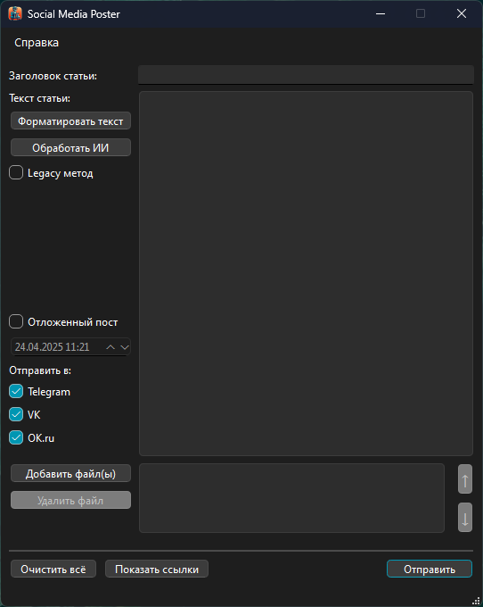

# Social Media Poster

  

Simple software for creating an article and sending it to Telegram channel, vk.com and ok.ru groups.  

**Features**
 - Asynchronous
 - Supports uploading more than 10 media files
 - Supports delayed posting (vk and ok)
 - Successful posting returns links to these posts
 
**Doesn't work now**
 - Delayed posting to Telegram
 - Video upload to ok.ru

 
## How to run

 1. Install [Python](https://www.python.org/downloads/) (>=3.11)
 2. Run commands in terminal:
	```bash  
	git clone https://github.com/scrooffy/SocialMediaPoster.git
	# create virtual environment  
	python -m venv venv
	# For Windows:  
	venv\Scripts\activate.bat  
	# For Mac OS and Linux:  
	source venv/bin/activate
	pip install -r requirements.txt
	python mainwindow.py
	```

## How to build

 1. Install pyInstaller
	```bash
	pip install pyinstaller
	```
 2. Run command:
	 ```bash
	 pyinstaller --noconfirm --onedir --windowed --icon "icon256.ico" --name "Social Media Poster" --add-data "settings/settings.json;." --add-data "icon256.png;." --copy-metadata "magic_filter"  "mainwindow.py"
	 ```
3. Make directory `settings` and move file `settings.json` to this dir

## Configure settings
For the application to work properly, you need to add api tokens and other settings to the `settings.json` file.

**Inital state of settins.json file**
```json
{  
  "telegram": {  
      "bot_token": "",  
      "chat_id": "",  
      "group_name": "name of group for link making"  
  },  
  "vk": {  
      "token": "",  
      "group_id": ""  
  },  
  "ok": {  
    "access_token": "",  
    "application_key": "",  
    "application_secret_key": "",  
    "session_secret_key": "do not need",  
    "group_id": ""  
  }  
}
```
### Telegram

 1. [Create a bot](https://core.telegram.org/bots/features#creating-a-new-bot) and copy token to `bot_token` field
 2. Add new bot to your channel
 3. Find the channel ID (maybe [this bot](https://t.me/username_to_id_bot) will help) and copy it to `chat_id` field (**IMPORTANT: add a minus "-" to beginning of string**)
 4. Copy nickname of channel to `group_name` without @

### VK

 1. [Create app](https://dev.vk.com/ru/admin/apps-list)
 2. Move to application settings and copy ID
 3. In this link, insert copied ID instead of `<app_id>`:
	`https://oauth.vk.com/authorize?client_id=<app_id>&redirect_uri=https://api.vk.com/blank.html&scope=offline,wall,photos,video&response_type=token`
4. Paste the ready link into the browser and press Enter
5. Your token is in the browser's link field after `token=`
6. Copy this token to `token` field
7. Copy ID of group in link like `https://vk.com/public<group_id>` and copy to `group_id` field

### OK.ru
 1. Obtain developer rights and create an application using the [official documentation](https://apiok.ru/dev/app/create).
	You need the following access rights:
	1. VALUABLE_ACCESS
	2. LONG_ACCESS_TOKEN
	3. PHOTO_CONTENT
	4. GROUP_CONTENT
2. Add access token to `access_token`
3. Add application key to `application_key`
4. Add application secret key to `application_secret_key`
5. You can add session secret key to `session_secret_key`, but it doesn't need to work
6. Copy ID of group in link like `https://ok.ru/group/<group_id>` and copy to `group_id` field

*Deleloped for "Призыв" newspaper*

## Licence
MIT

